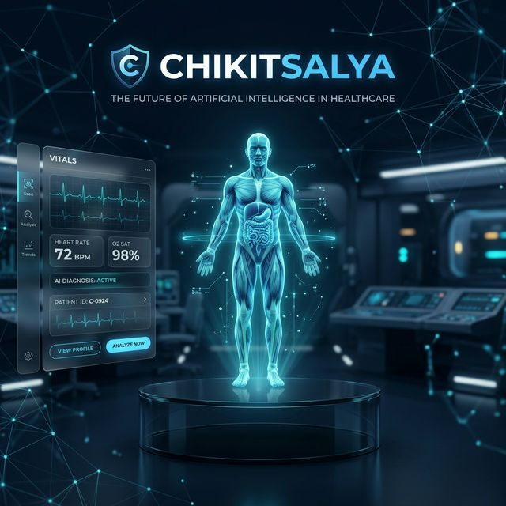
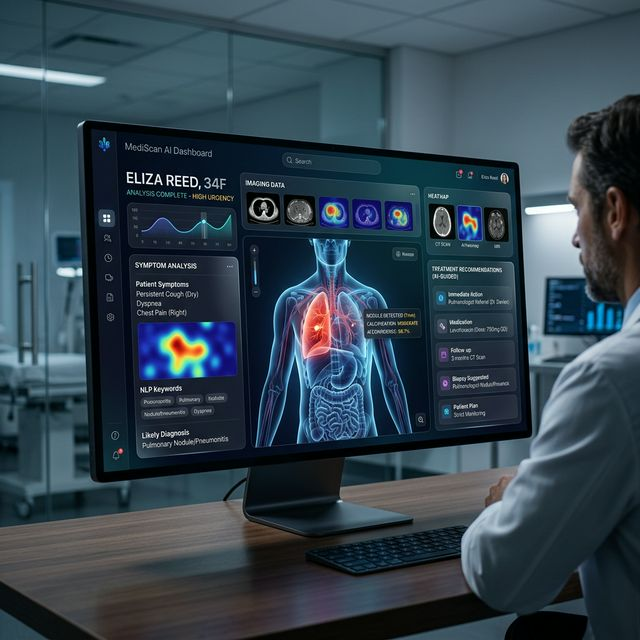
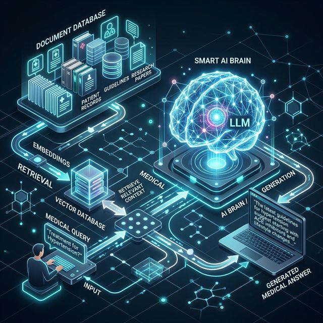

# 🏥 Chikitsalya — AI-Powered Rural Telehealth & Clinical Decision Support



## 🌍 Overview
**Chikitsalya** is a state-of-the-art AI-driven medical assistance platform engineered for rural accessibility, early diagnosis, and clinical decision support. It bridges the gap between underserved communities and quality healthcare through advanced machine learning and real-time medical knowledge retrieval.

---

## 🎯 The Vision
Healthcare in rural areas faces critical challenges:
- ❌ **Doctor Shortage**: Thousands of patients per qualified physician.
- ❌ **Delayed Diagnosis**: Simple conditions often progress due to lack of early screening.
- ❌ **Cost Barriers**: High-end diagnostic tools are often unavailable or unaffordable.

**Chikitsalya provides a "Medical First Responder" in the palm of your hand.**

---

## 🚀 Key Features

### 🤖 Intelligent Symptom Analysis
Using a high-accuracy **Random Forest Classifier**, Chikitsalya predicts potential conditions based on patient-reported symptoms, providing a confidence score to aid triage.

### 📚 Medical Knowledge RAG (Retrieval-Augmented Generation)

- **Massive Database**: Indexed with over **16,000+ medical entries** (MedLine Plus MedQuad).
- **FAISS Engine**: Lightning-fast vector search for evidence-based medical advice.
- **Explainable Results**: Directly retrieves verified medical text to ground AI predictions in reality.

### ⚠️ Real-time Risk Assessment
- ML models evaluate urgency and severity.
- **Emergency Triggers**: Instant alerts for life-threatening symptoms (chest pain, breathing difficulty).

### 🏥 Hospital & Pharmacy Connectivity
- Automatically finds the nearest healthcare facilities for immediate referral and action.



---

## 🏗️ Technical Architecture

| Layer | Technology |
|------|-----------|
| **UI Framework** | HTML5, CSS3 (Premium Glassmorphism), JavaScript, EJS |
| **Logic Server** | Node.js, Express |
| **AI Backend** | Python 3.x, Flask, scikit-learn |
| **Knowledge Engine** | FAISS, Sentence-Transformers (`all-MiniLM-L6-v2`) |
| **Translation** | deep-translator (Google Translator API) |
| **Data Engine** | Pandas, NumPy, joblib |

---

## ⚙️ Quick Start

### 1️⃣ Clone the Repo
```bash
git clone https://github.com/Siddharthchandra123/IIT_BHU_Pre_Zonals.git
cd IIT_BHU_Pre_Zonals
```

### 2️⃣ Start AI Services (Python)
Ensure Python 3.8+ is installed.
```bash
cd local_host
pip install -r requirements.txt
python API.py
```

### 3️⃣ Start Main Server (Node.js)
In a separate terminal:
```bash
cd local_host
npm install
npm start
```

### 4️⃣ Launch Platform
Visit [http://localhost:3000](http://localhost:3000)

---

## 🛡️ Safety & Disclaimer
Chikitsalya is a **Clinical Decision Support System (CDSS)**. It is designed to assist healthcare workers and patients in triage and screening. It **does not** replace professional medical diagnosis, and critical cases should always seek immediate attention from a human physician.

---

## 👨‍💻 Author
**Siddharth Chandra**

---

## ⭐ Show Your Support
Support rural healthcare by giving this project a ⭐ on GitHub!